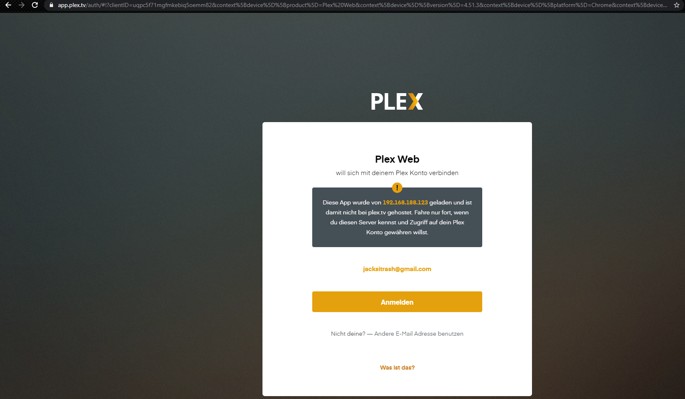

# **Dokumentation**
S. Hofer - M300 LB2

## **Inhalt**
1. [Vorhaben](#Vorhaben)

2. [Entscheidung](#Entsch)  
    2.1. [Auswahl VW](#AuswVM)  
    2.2. [Auswahl Dienst](#AuswService)  
    2.3. [Notwendige Konfiguration VM](#Konf)  
    2.4. [Optionale Konfiguration VM](#OptKonf)

3. [Vorgehen](#Vorgehen)   
    3.1. [VM erstellen](#VMerst)  
    3.2. [VM konfigurieren](#VMkonf)  
    3.3. [Plex-Mediaserver konfigurieren](#Plexkonf)

4. [Testen](#Test)

-----------------

## **1. Vorhaben** <a name="Vorhaben"></a>
Diese LB befasst sich mit der Kreierung einer Vagrant File.
Das File soll einerseits eine VM von sich aus installieren und einen dazu ausgewählten Service installieren/konfigurieren. Darüber hinaus muss die VM so konfiguriert werden, dass der Service automatisch von aussen bzw. vom Host System her erreichbar ist.

## **2. Entscheidung** <a name="Entsch"></a>

### **2.1. Auswahl VM** <a name="AuswVM"></a>
Der Einfachheit halber wird eine bereits existierende Vagrant VM verwendet. Diese ist ein Linux Ubuntu (xenial64).
Als Programm zur Verwendung der VM wird Virtualbox eingesetzt.

### **2.2. Auswahl Dienst** <a name="AuswService"></a>
Ich habe mich für die Erstellung einer VM mit Plex-Mediaserver entschieden. Ein Plex-Mediaserver kann Mediendateien zur Vefügung stellen, welche mit den korrekten Einstellungen von überall her über den Plex Player abgespielt werden können. Der Plex-Mediaserver kann über den korrekten Port, im lokalen Netz, von einem Webbrowser aus aufgerufen werden.

### **2.3. Notwendige Konfiguration VM** <a name="Konf"></a>
Damit das gewünschte Vorhaben umgesetzt werden kann, müssen folgende Konfigurationen vorgenommen werden:
- Ports
    - 80 aussen / 8080 innen
    - 32400 aussen / 32400 innen

- Bestimmung der IP der VM (variabel, da sich die IP im lokalen Netzwerk des Hosts befinden muss)

### **2.4. Optionale Konfiguration VM** <a name="OptKonf"></a>
In dieser VM werden folgende optionale Konfigurationen vorgenommen:
- Name der VM in Virtualbox
- Zuweisung RAM

---

## **3. Vorgehen** <a name="Vorgehen"></a>
- Als erstes wird der Code für die Erstellung der VM verfasst und geprüft.
- Danach werden die Einstellung in der VM wie z.B. Öffnen der notwendigen Ports vorgenommen.
- Zum Schluss wird ein Script verfasst, welches den Plex-Mediaserver installiert und konfiguriert.

Der gesamte Code sieht wie folgt aus:

```
Vagrant.configure("2") do |config|

  config.vm.box = "ubuntu/xenial64"
  
  config.vm.network :forwarded_port, guest: 80, host: 8080
  config.vm.network "forwarded_port", guest: 32400, host: 32400

  config.vm.network "public_network", ip: "192.168.188.123"

  config.vm.provider "virtualbox" do |v|
  # v.gui = true
    v.name = "PlexVagrant"
    v.memory = "2048"
  end
  
  config.vm.provision :shell, :path => "InstallPlex.sh"
  
end
```

### **3.1. VM erstellen** <a name="VMerst"></a>
Nachfolgend wird der Code aufgeführt und erklärt, welcher die VM erstellt.

```
Vagrant.configure("2") do |config|  
    config.vm.box = "ubuntu/xenial64"  
end
```

Vagrant.configure("2") do |config|  
`Hiermit wird festgelegt, dass die VM mit dem Attribut "config" konfiguriert wird.`

config.vm.box = "ubuntu/xenial64"  
`Mit dem Attribut "config" wird nun die VM ausgewählt, welche von der Vagrant Seite direkt heruntergeladen wird.`

end  
`Mit dem Befehl 'end' wird Code beendet`

### **3.2. VM konfigurieren** <a name="VMkonf"></a>
Nachfolgend werden die Codes aufgeführt und erklärt, mit welchem die VM konfiguriert wird.

```
config.vm.network :forwarded_port, guest: 80, host: 8080
config.vm.network "forwarded_port", guest: 32400, host: 32400

config.vm.network "public_network", ip: "192.168.188.123"

config.vm.provider "virtualbox" do |v|
# v.gui = true
  v.name = "PlexVagrant"
  v.memory = "2048"
end
```

config.vm.network :forwarded_port, guest: 80, host: 8080  
`Mit diesem Befehl werden die Ports 80 sowie 8080 geöffnet. Somit gelangt man über den Port 80 von aussen hin an den Port 8080 innen.`

config.vm.network "forwarded_port", guest: 32400, host: 32400  
`Mit diesem Befehl wird der Port 32400 geöffnet. Somit gelangt man über den Port 32400 von aussen hin an den Port 32400 innen.`

config.vm.network "public_network", ip: "192.168.188.123"  
`Diese Zeile setzt das Netzwerk der VM auf "Öffentliches Netzwerk" und vergibt der VM die IP 192.168.188.123.`

config.vm.provider "virtualbox" do |v|  
`Hiermit wird festgelegt, dass die Eigenschaften der VM mit dem Attribut "v" konfiguriert werden.`

\# v.gui = true  
`Dieser Befehl lässt die VM über ein GUI verwalten. Wurde jedoch auskommentiert, da es nicht notwendig ist.`

v.name = "PlexVagrant"  
`Dadurch erhält die VM den Namen "PlexVagrant" in Virtual Box.`

v.memory = "2048"  
`Hiermit wird der VM 2GB RAM zugewiesen.`

end  
`Mit dem Befehl 'end' wird die Konfiguration von config.vm.provider beendet`

### **3.3. Plex-Mediaserver konfigurieren** <a name="Plexkonf"></a>

Folgender Code wird verwendet, um Plex-Mediaserver auf der VM zu installieren:

```
config.vm.provision :shell, :path => "InstallPlex.sh"
```

config.vm.provision :shell, :path => "InstallPlex.sh"  
`Hiermit wird der VM mitgeteilt, dass ein Shellscript ausgeführt werden soll und in welchem Pfad bzw. welchem File sich die Befehle befinden.`

Shell File:

```
echo "deb https://downloads.plex.tv/repo/deb public main" > /etc/apt/sources.list.d/plexmediaserver.list
wget -q -O "-" https://downloads.plex.tv/plex-keys/PlexSign.key | sudo apt-key add -
sudo apt-get -y update
sudo apt-get -y upgrade
sudo apt-get -y install plexmediaserver --option=Dpkg::Options::=--force-confdef
```

echo "deb https://downloads.plex.tv/repo/deb public main" > /etc/apt/sources.list.d/plexmediaserver.list  
`Mit diesem Befehl wird das Installationspaket für den Plex-Mediaserver heruntergeladen und in den abgebildeten Pfad geschrieben.`

wget -q -O "-" https://downloads.plex.tv/plex-keys/PlexSign.key | sudo apt-key add -  
`Dadurch wird ein Key heruntergeladen  und hinzugefügt damit keine Interaktion durch den Benutzer notwendig ist, um zu bestätigen, dass die Installation von einer vertrauenswürdigen Quelle stammt.`

sudo apt-get -y update  
sudo apt-get -y upgrade  
`Hierdurch wird Ubuntu auf den neusten Stand gebracht.`

sudo apt-get -y install plexmediaserver --option=Dpkg::Options::=--force-confdef  
`Mit diesem Befehl wird der Plex-Mediaserver installiert. Mit dem 'force' Befehl umgeht man die Eingabe durch einen Nutzer, um zu bestätigen, dass das Paket tatsächlich installiert werden soll.`

---

## **4. Testen** <a name="Test"></a>

Mit dem Befehl 'vagrant up', welcher in Git Bash ausgeführt wird, wird die Installation der VM ausgeführt.

Nach erfolgreicher Installation wird auf dem Host ein Web Browser geöffnet.

Die URL für den Aufruf des Plex-Mediaserver lautet wie folgt:

```
192.168.188.123:32400/web
```

Man wird auf den Plex-Mediaserver weitergeleitet. Da kann man sich anmelden oder ein Konto erstellen und mit der Konfiguration des Servers beginnen.

